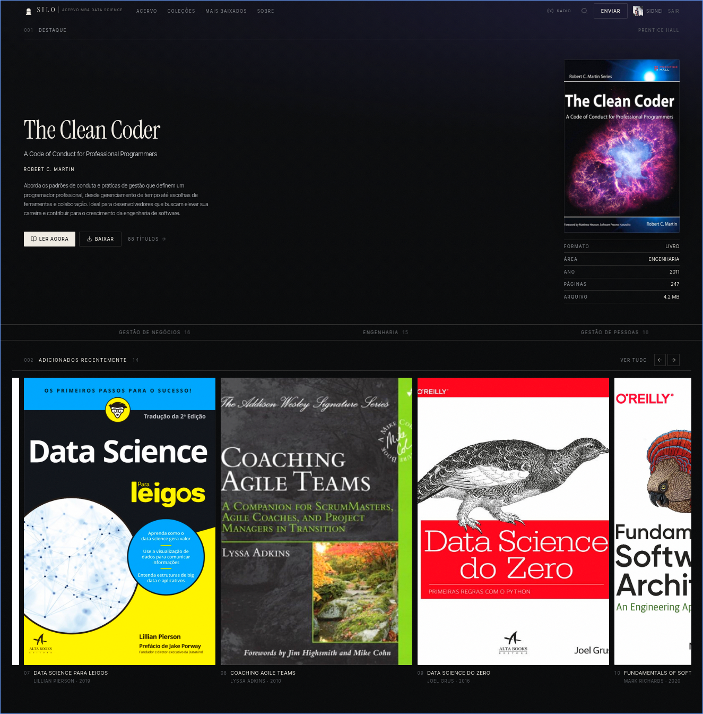

# Silo

Acervo digital do MBA Data Science. Uma estante compartilhada — livros, apostilas, casos e artigos em PDF.

<p align="center">
  
</p>

---

Silo é a biblioteca da turma: consulta aberta, envio autenticado, leitor próprio e uma identidade editorial em preto absoluto.

O nome vem do que guarda a safra — e, aqui, do que a turma aprendeu.

## O que há na estante

- **Catálogo** com busca instantânea, trilhos por área e vista de índice
- **Leitor** em tela cheia (pdf.js), com zoom, busca, atalhos e texto selecionável
- **Envio** com dropzone, metadados sugeridos e compactação de PDF
- **Capas** resolvidas pela Open Library e pelo Google Books, guardadas junto dos arquivos
- **Contas** com usuário e senha — a primeira criada é administradora
- **Rádio** da estante no cabeçalho, para acompanhar a leitura

## Stack

| Camada | Tecnologia |
| --- | --- |
| Aplicação | Next.js 16 (App Router), React 19, TypeScript, Tailwind v4 |
| Catálogo e contas | Neon (Postgres) |
| Arquivos | Vercel Blob, Backblaze B2 ou Cloudflare R2 — bucket privado |
| Desenvolvimento | Sistema de arquivos em `.data/`, sem credenciais |

Os drivers de armazenamento compartilham a mesma interface em `src/lib/storage/`. A escolha é automática: Blob, em seguida S3-compatível, por último o disco local.

## Começar

```bash
npm install
cp .env.example .env.local
npm run dev
```

Sem credenciais de armazenamento o projeto sobe em modo local, com um acervo de demonstração. Defina `SEED_DEMO=false` para desligar a semente.

O restante das variáveis está documentado em [`.env.example`](.env.example).

## Armazenamento

O envio sai do navegador por URL assinada (ou handshake de client upload, no Blob). O servidor não carrega o PDF.

```
livros/<id>/<arquivo>.pdf    original
capas/<id>.jpg               capa persistida
catalogo/                    metadados — só no modo sem banco
```

Com `DATABASE_URL`, o Neon guarda usuários e catálogo; o bucket fica só com os arquivos.

### Vercel Blob

Ativado por `BLOB_READ_WRITE_TOKEN`. Use `NEXT_PUBLIC_BLOB_BASE_URL` para as capas saírem direto do CDN.

No plano Hobby: 1 GB de armazenamento, 10 GB de transferência, 10 mil operações simples e 2 mil avançadas por mês. Estourar qualquer teto bloqueia a store por 30 dias — acompanhe em Observability e envie PDFs já compactados.

### Backblaze B2

Bucket **privado**. O plano gratuito cobre 10 GB e egress até 3× o armazenamento médio do mês.

```
B2_KEY_ID=
B2_APPLICATION_KEY=
B2_BUCKET=silo-acervo
B2_ENDPOINT=https://s3.us-west-004.backblazeb2.com
```

O CORS do painel libera só `GET` e `HEAD`. O envio precisa de `s3_put` e de `content-type`:

```bash
npm run b2-cors
npm run b2-cors -- --origem https://seu-dominio
npm run b2-cors -- --ver
```

A master application key não funciona na API S3. Use uma chave de aplicação com o bucket selecionado. Se o bucket já tiver regras nativas, o script fala com a API do B2 — a S3 recusa `PutBucketCors`.

### Cloudflare R2

```
R2_ACCOUNT_ID=
R2_ACCESS_KEY_ID=
R2_SECRET_ACCESS_KEY=
R2_BUCKET=
```

`R2_PUBLIC_BASE_URL` é opcional, para um domínio público na frente do bucket.

## Banco

Crie um projeto em [neon.tech](https://neon.tech) e coloque a connection string em `DATABASE_URL`. Também valem `POSTGRES_URL`, `DATABASE_URL_UNPOOLED` e `POSTGRES_URL_NON_POOLING`.

As tabelas `usuarios` e `livros` nascem no primeiro acesso.

```bash
npm run db                     # tabelas e contagens
npm run db -- --limpar-demo    # remove títulos de demonstração
```

Sem Postgres, contas e catálogo caem em JSON no próprio armazenamento — útil para desenvolver, insuficiente para produção.

Cadastro é usuário e senha, com `scrypt` e cookie assinado por `SESSION_SECRET`. Consultar o acervo não exige conta; publicar, sim. Remover um título cabe a quem o enviou ou a um administrador.

## Compactação

PDFs mal exportados ocupam o bucket à toa. O caminho recomendado é compactar **antes** do envio:

```bash
npm run preparar livro.pdf     # gera livro-otimizado.pdf ao lado
```

Ghostscript reamostra imagens (170 dpi, `PDF_TARGET_DPI`) e faz subset das fontes; qpdf recomprime sem perda; sem esses binários, resta uma regravação estrutural com `pdf-lib`. Fica o menor arquivo que ainda abre e preserva o número de páginas — ou o original, se o ganho for menor que 3%.

A Vercel não traz Ghostscript nem qpdf. Para o que já está no armazenamento:

```bash
npm run otimizar
```

Limite de envio: 200 MB por arquivo.

## Marca

O kit completo — glifo, letreiro, respiro, paleta e usos — está em `/marca`. Os SVG ficam em `public/marca/`; o glifo também é o favicon.

## Estrutura

```
src/app/                  páginas e rotas de API
  acervo/                 grade, busca e índice
  colecoes/               áreas do curso
  livro/[slug]/           ficha e leitor
  enviar/                 dropzone e formulário
  entrar/, criar-conta/   autenticação
  marca/                  kit de identidade
src/components/
src/lib/
  storage/                Blob, S3 e disco — mesma interface
  catalog*.ts             Neon ou JSON
  db/                     conexão e tabelas
```

## Scripts

| Comando | Função |
| --- | --- |
| `npm run dev` | desenvolvimento |
| `npm run build` | build de produção |
| `npm run start` | serve o build |
| `npm run lint` | ESLint |
| `npm run db` | inspeção do Postgres |
| `npm run capas -- --usuario X --senha Y` | baixa capas que faltam |
| `npm run pdfs -- --usuario X --senha Y` | compacta PDFs pelo servidor |
| `npm run preparar arquivo.pdf` | compacta um PDF antes do envio |
| `npm run otimizar` | compacta o que já está no armazenamento |
| `npm run b2-cors` | regras de CORS do Backblaze B2 |

O `postinstall` copia o worker do pdf.js para `public/`.

---

<p align="center">
  Iniciativa independente de alunos, sem vínculo oficial com a USP, a Esalq ou a Fealq.<br />
  Envie apenas material que você tem direito de compartilhar.
</p>
